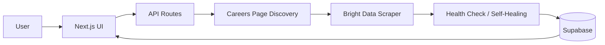

# Scrape Verse

Type a company name, get their job listings. Built with Next.js, Bright Data, and Supabase.

When a careers page breaks, the scraper fixes itself automatically.

## What it does

1. You search for a company.
2. It finds the company's careers page.
3. It creates a Bright Data scraper for that page.
4. It pulls the jobs and shows them.
5. If the page changes and the scraper breaks, it repairs itself.

## Setup

You need:

- Node.js 18+
- A [Bright Data](https://brightdata.com) account and API token
- A [Supabase](https://supabase.com) project

### 1. Install

```bash
npm install
```

### 2. Add environment variables

Create a `.env.local` file:

```bash
BRIGHTDATA_API_TOKEN=your_api_token
BRIGHTDATA_COLLECTOR_ID=c_xxxxxxxxxxxx

NEXT_PUBLIC_SUPABASE_URL=https://your-project.supabase.co
NEXT_PUBLIC_SUPABASE_ANON_KEY=your_anon_key
SUPABASE_SERVICE_ROLE_KEY=your_service_role_key

NEXT_PUBLIC_APP_URL=http://localhost:3000
```

### 3. Set up the database

Open the SQL Editor in Supabase and run `src/lib/db/schema.sql`.

### 4. Run it

```bash
npm run dev
```

Then open http://localhost:3000.

## How it works

- **Discovery** — guesses the company domain, then checks common careers paths like `/careers` or `/jobs`.
- **Scraper** — Bright Data's AI Flow writes a scraper for the found page.
- **Health check** — scores each scrape result from 0–100.
- **Self-healing** — if the score drops, it asks Bright Data to fix the scraper and tries again.
- **Storage** — jobs go into Supabase and update instead of duplicating.

## Architecture



A search starts in the Next.js UI, which finds a company's careers page and sends it to Bright Data to scrape. The result is scored for quality and sent through the self-healing step if it breaks. Jobs are stored in Supabase and shown back to the user.

## Project layout

```
src/
  app/        # Pages and API routes
  lib/
    brightdata/  # Bright Data API calls
    company/     # Careers page discovery
    scraper/     # Scrape, score, and heal
    db/          # Supabase and schema
```

